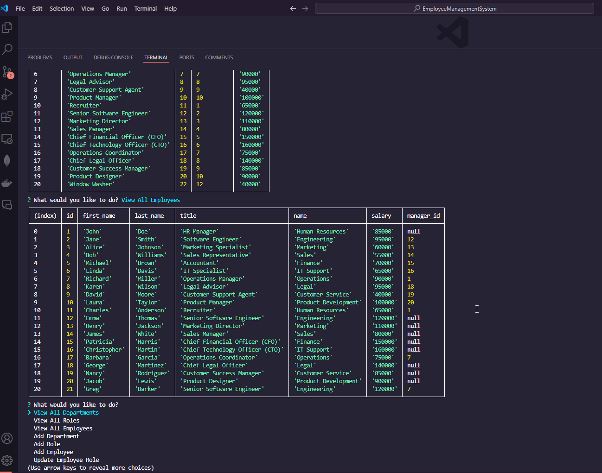

# Employee Management System CLI


## Table of Contents

- [Employee Management System CLI](#employee-management-system-cli)
  - [Table of Contents](#table-of-contents)
  - [Description](#description)
  - [Installation Instructions](#installation-instructions)
  - [Usage Instructions](#usage-instructions)
    - [Example](#example)
  - [Contributing Guidelines](#contributing-guidelines)
  - [License Information](#license-information)
  - [Acknowledgments](#acknowledgments)
  - [Questions](#questions)
  - [Resources](#resources)

## Description

The Employee Management System CLI is a command-line application that enables users to manage employees, roles, and departments within a company. This tool provides an interactive experience for viewing, adding, and updating employee information, roles, and departments in a PostgreSQL database.

This CLI is built with:

- **Node.js** for runtime environment
- **TypeScript** for type safety and scalability
- **PostgreSQL** for data storage and management
- **Inquirer.js** for an interactive user experience

## Installation Instructions

To install the Employee Management System CLI, follow these steps:

1. Clone the repository to your local machine:

   ```bash
   git clone https://github.com/your-username/employee-management-system-cli.git
   ```

2. Navigate to the project directory:

   ```bash
   cd employee-management-system-cli
   ```

3. Install the required dependencies:

   ```bash
   npm install
   ```

4. Set up your `.env` file in the root directory with the following environment variables (adjust with your local PostgreSQL credentials):

   ```env
   LOCAL_PG_USER=postgres
   LOCAL_PG_PASSWORD=your_password
   LOCAL_PG_HOST=localhost
   LOCAL_PG_PORT=5432
   LOCAL_PG_DATABASE=ems_db
   ```

## Usage Instructions

To use the Employee Management System CLI:

1. **Start the application** by running the following command:

   ```bash
   npm run start
   ```

2. **Follow the interactive prompts** to manage the employee database. The available options are:

   - View All Departments
   - View All Roles
   - View All Employees
   - Add a Department
   - Add a Role
   - Add an Employee
   - Update Employee Role
   - Exit

3. The system will update the PostgreSQL database based on your inputs.

### Example



## Contributing Guidelines

Contributions to the Employee Management System CLI are welcome! To contribute:

1. Fork the repository.
2. Create a new branch for your feature or bug fix:
   ```bash
   git checkout -b feature-name
   ```
3. Make your changes and commit them with clear, descriptive messages.
4. Push your changes to your forked repository:
   ```bash
   git push origin feature-name
   ```
5. Submit a pull request with a detailed description of your changes.

## License Information

This repository is covered under the MIT License. For more information, see the [LICENSE](./LICENSE) file.

## Acknowledgments

Special thanks to:

- **Inquirer.js**: For providing a simple way to build interactive command-line applications.
- **PostgreSQL**: For being a robust and scalable relational database.
- **Node.js**: For offering an easy-to-use JavaScript runtime on the server side.
- **TypeScript**: For helping developers write clean, scalable, and maintainable code.

## Questions

For any questions or support, feel free to reach out:

- GitHub: [savevsgames](https://github.com/savevsgames)
- Email: [gregcbarker@gmail.com](mailto:gregcbarker@gmail.com)

For issues or suggestions, please create a [GitHub issue](https://github.com/savevsgames/employee-management-system-cli/issues).

## Resources

- [Inquirer.js Documentation](https://github.com/SBoudrias/Inquirer.js)
- [Node.js Documentation](https://nodejs.org/)
- [PostgreSQL Documentation](https://www.postgresql.org/docs/)
- [TypeScript Documentation](https://www.typescriptlang.org/)
